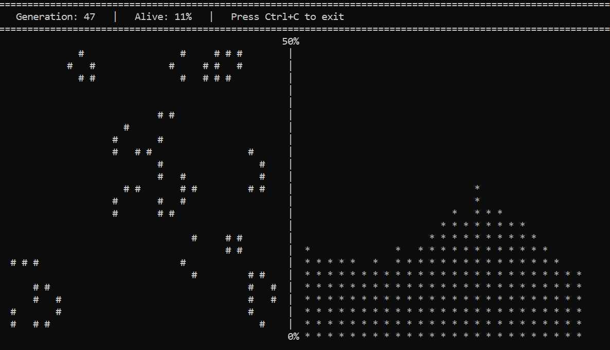

# Conway's Game of Life (C++ & x64 Assembly)

Высокопроизводительная реализация легендарной игры «Жизнь» Джона Конвея с визуализацией популяции в реальном времени.

## Интерфейс игры

## Особенности проекта
* **Ядро симуляции:** Написано на чистом ассемблере x86-64 (MASM) с ручной оптимизацией работы с регистрами процессора.
* **Интерфейс и ООП:** Логика классов, выделение динамической памяти в Куче и вывод матрицы на экран реализованы на C++.
* **Передача параметров:** Использовано соглашение о вызовах Microsoft x64 (параметры передаются через регистры RCX, RDX, R8, R9 и стек).
* **Телеметрия:** Реализован одновременный вывод игрового поля и динамического графика текущей популяции (масштабирование до 50%).

## Как запустить
1. Откройте файл `GameOfLife.sln` в Visual Studio.
2. Убедитесь, что выбрана конфигурация **x64** (Debug или Release).
3. Запустите проект (F5).
